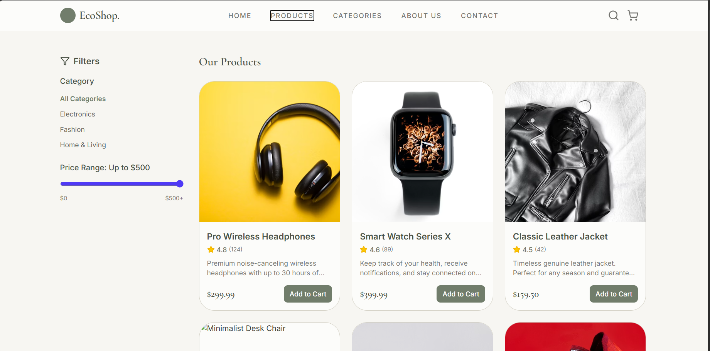
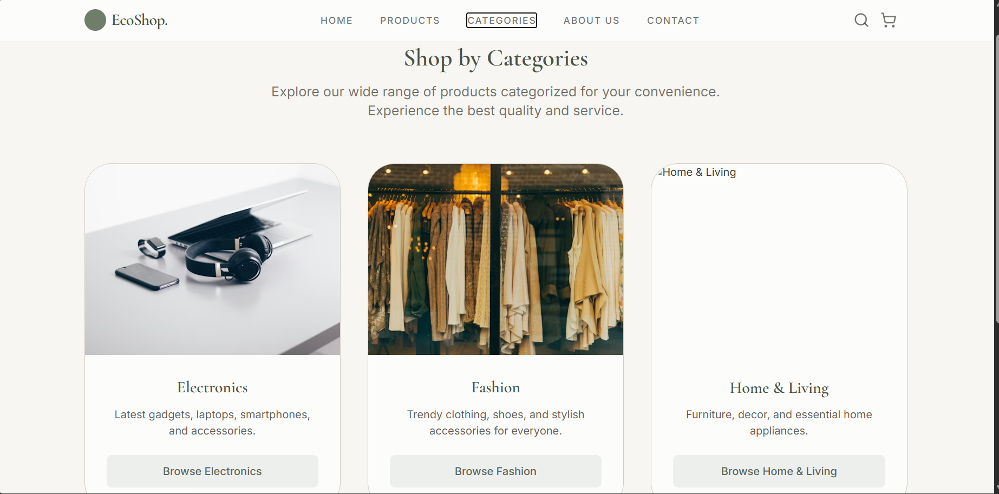
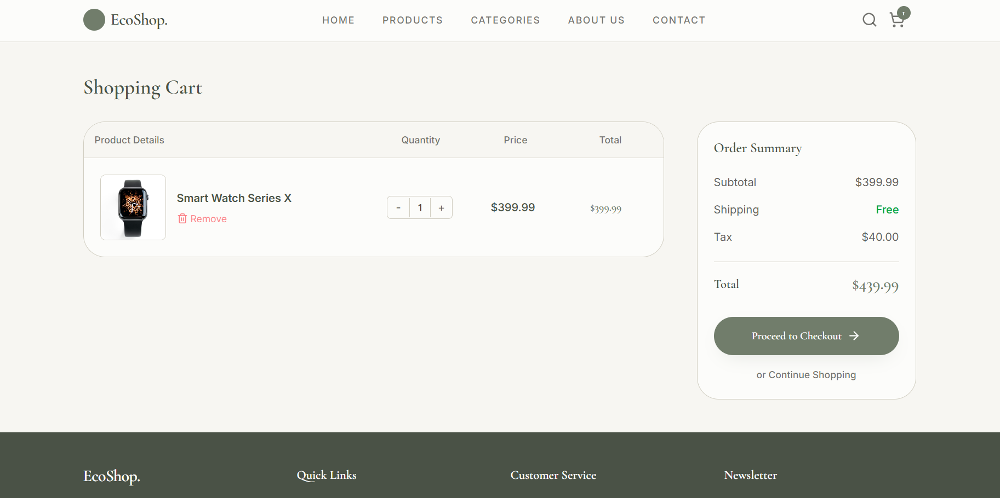

# Eco_Shop

Eco_Shop is a modern and responsive e-commerce web application built with a vanilla JavaScript frontend. It features a dynamic home page, product search with filtering, shopping cart management, and wishlist functionality.

## 🚀 Features

### Frontend
- **Home Page**: 
  - Dynamic hero slider (configurable via API).
  - "Shop by Category" section.
  - "Latest Products" grid with hover effects.
  - Service features highlights.
  - Responsive navigation bar with scroll effects.
- **Product Search & Discovery**:
  - Real-time search functionality.
  - Filters for Category, Price Range, and Rating.
  - Sorting options (Price, Rating, Newest).
  - Toggle between Grid and List views.
- **User Interaction**:
  - **Quick View**: Modal popup to view product details without leaving the page.
  - **Cart**: Add to cart functionality with visual feedback (animations).
  - **Wishlist**: Toggle items in and out of a wishlist.
  - Toast notifications for user actions.
- **Responsive Design**: Fully optimized for mobile, tablet, and desktop screens.

## 🛠️ Tech Stack

- **Frontend**: HTML5, CSS3 (Custom animations, Flexbox/Grid), JavaScript (ES6+).

## ⚡ Installation & Setup

1.  **Prerequisites**: Ensure you have [Node.js](https://nodejs.org/) installed on your machine.

2.  **Clone/Download the repository**.  

## Home Page
  

## Product Page
  

## Category Page
  

## Cart Page
  